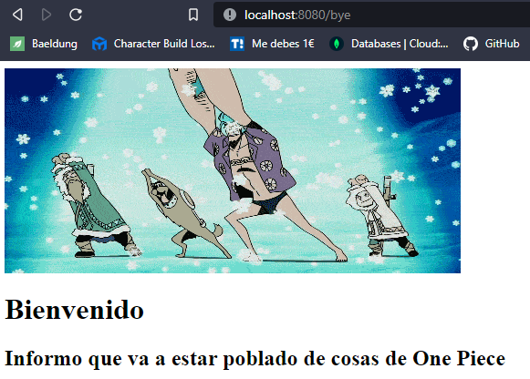
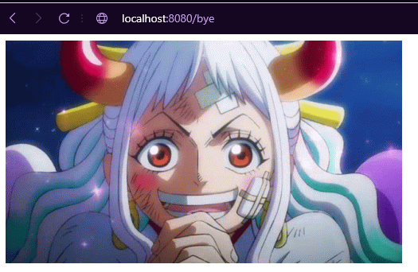
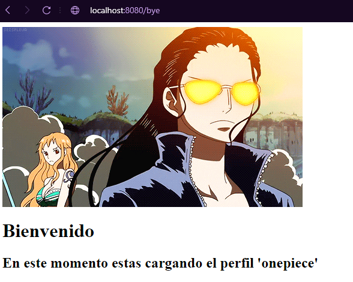
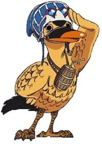

# Quark_Bye

## Que es Quark_bye?

Tranquilo , solo es una prueba no es muy importante para ti, a no ser que quieras ver el proceso de un mono golpeando el teclado y que hace una API REST con quarkus.

# Pasos realizados

Se han realizado los pasos suponiendo que maven ya esta instalado , si no , el primer paso es instalar maven.

## Crear Hello World

Lanzamos maven con el pluguin de quarkus y su version, para encontrar la version actualizada he buscado el plugin de quarkus y he seleccionado a su pagina oficial [Quarkus](https://quarkus.io/guides/maven-tooling)

```bash
$ mvn io.quarkusplatform:quarkus-maven-plugin:2.7.5.Final:create \
    -DprojectGroupId=edu.poniperro \
    -DprojectArtifactId=my-getting-started \
    # para generar la clase REST
    -DclassName="edu.poniperro.quickstart.GettingResource" \
    # Primera ruta
    -Dpath="/bye"
```

Ahora se generara la aplicacion y para lanzar nuestra aplicacion en modo dev. El modo dev lo que hace es que no hay necesidad de compilar cada vez que hagamos un cambio , hará restart de una forma bastante rapida.

```bash
$ ./mvnw compile quarkus:dev
```

La aplicacion estara corriendo en el localhost:8080

Para comprobar que funciona usamos:

```bash
$ curl localhost:8080/bye
```

En el caso que no develva nada deberiamos comprobar que el path se ha creado como esperabamos, se encuentra en `./code-with-quarkus/src/java/edu/poniperro/quickstart/GreetingResource.java`

Estara entre parentesis en un @Path , como es de suponer , ahi defines el path. En el caso de que no ponga "/bye" es por eso que no os funciona.

Si no os gusta la consola o le teneis miedo porque a veces muerde o grita , podemos ir al navegador y ponel en el buscador `localhost:8080/bye`

### El curioso del hello world

Si te fijas en el codigo que hay en el path:

```Java
@Path("/bye")
public class GreetingResource {

    @GET
    @Produces(MediaType.TEXT_PLAIN)
    public String hello() {
        return "bye";
    }
```

En @Produces(MediaType.TEXT_PLAIN) hay TEXT_PLAIN , eso significa que puede producir otro tipo de texto , asi que deciciprobar el primero que salia que era TEXT_HTML y añadir un codigo HTML que quedo de esta manera:

```Java
@Path("/bye")
public class GreetingResource {

    @GET
    @Produces(MediaType.TEXT_HTML)
    public String hello() {
        return ""
                +
                "<h1>Bienvenido</h1>" +
                "<h2>Informo que va a estar poblado de cosas de One Piece</h2>";
    }
```

Por arte de magia funciona



## Parametros configuracion

Por defecto cuarkus lee la configuracion en el fichero application.properties, que se encuentra en `./code-with-quarkus/src/main/resources/application.properties`

añadimos una linea con para definir un parametro que en mi caso , como quiero que se vea lo de siempre es meter todo el return sin comillas en una sola linea.

```Java
greetings.inicio="<h1>Bienvenido</h1><h2>Informo que va a estar poblado de cosas de One Piece</h2>
```

_Ya se que es una porqueria pero me hacia ilu_ 👉👈

Ahora vamos al codigo y añadimos el siguiente codigo

De esta manera no es un return estatico , sino lo que esta configurado en `./code-with-quarkus/src/main/resources/application.properties`

```Java
    @ConfigProperty(name = "greetings.inicio")
    String msg;
```

Ahora solo tenemos que cambiar el return y poner que devuelve `msg`.

## Compilar de forma nativa

Para compilar de forma nativa vamos a hacerlo en un Docker con el siguiente comando:

```bash
$ ./mvnw package -Pnative -Dnative-image.docker-build=true -DskipTests
```

Ahora tenemos un binario que solo va a funcionar en un contenedor docker.
Asi que creamos el docker con el siguiente comando:

```bash
$ docker build -f src/main/docker/Dockerfile.native -t quakus/gettingstarted .
```

y podemos lanzarlos con:

```bash
$ docker run -i --rm -op 8080:8080 quarkus/getting-started
```

Con esto veremos que cuando compila en nativo la velocidad de arrancada es muy rapida , pero como vamos a estar compilando bastantes veces ya que de momento no tenemos una app definitiva

### Resumen de compilacion nativa

Users de Windows : Teneis problemas. Teneis que seguir esta [guia](https://quarkus.io/guides/building-native-image)

Users de Linux: Aun no he probado. Se supone que no tendreis problemas.

## Sobreescribir configuracion

Podemos sobreescribir los `greetings` de la siguiente manera:

```bash
$ ./mvnw compile quarkus:dev -Dgreetings.inicio="One piece"
```

Podremos comprobar que se ha cambiado con un curl:

```bash
$ curl localhost:8080/bye
```

Si podemos sobreescribir con texto plano vamos a comprobar si le metemos codigo HTML, ya que nosotros tenemos el return con `MediaType.TEXT_HTML`

```bash
$ ./mvnw compile quarkus:dev -Dgreetings.inicio=""
```

Parece ser que si funciona y este es el resultado



Recuerdo que al lanzarlo desde consola de esa manera el cambio solo estara mientras Quarkus este funcionando , ya que si la apagamos, dejara de estar a no ser que volvamos a lanzar quarkus volviendo a sustituir el parametro.

NOTA: Si usamos `s` en la consola de Quarkus para forzar un reinicio no desaparece. Porque se queda el parametro guardado.

## Perfiles de Configuración

Podemos establecer que en el modo dev los parametros sean distintos que cuando compilemos a un -jar.

Para hacer esto volvemos a `application properties`, y en mi caso como quiero cambiar el gif de salida en modo dev, dejo el fichero de la siguiente manera:

```conf
# Configuracion de perfiles

# Configuracion perfil dev

%dev.greetings.inicio=


greetings.inicio=<h1>Bienvenido</h1><h2>Informo que va a estar poblado de cosas de One Piece</h2>
```

De forma que cuando lancemos la aplicacion en forma de dev saldra cambiado lo especificado en el perfil de %dev.

## Customizar perfiles

Vamos a añadir un perfil llamado "onepiece" (esto es para que se vea que se puede poner cualquier nombre).

Abrimos el ficher donde pusimos la configuracion de perfiles la ultima vez y añadimos estas lineas de código

```conf

# Configuracion de perfil personalizado

%onepiece.greetings.inicio=<h1>Bienvenido</h1><h2>En este momento estas cargando el perfil 'onepiece'</h2>
```

Ahora tenemos creado el perfil onepiece con esta configuracion , ahora para cargar este perfil en el lanzamiento de la aplicacion hay que hacer lo siguiente:

```bash
$ ./mvnw compile quarkus:dev -Dquarkus-profile=onepiece
```

De forma que cambiará y se verá asi:



---

### Se esta realizando el curso de OpenWebinars por Alex Soto.

Todos los pasos seguidos se han tomado como referencia del curso y aqui me lo estoy documentando para un futurno no muy lejano cuando me olvide de como se hacia algo y porque más o menos.

Recomiendo encarecidamente el curso asi que si podeis pasaros lo disfrutareis.

De momento es un hello world con pruebas , espero que poco a poco pueda cambiar el README para que sea un mono tecleando algo que entiende.

El nombre de Quarkus me recuerda a la onomatopeya de un pato "cuak", asi que si que aqui os dejo a mi "cuakus"


