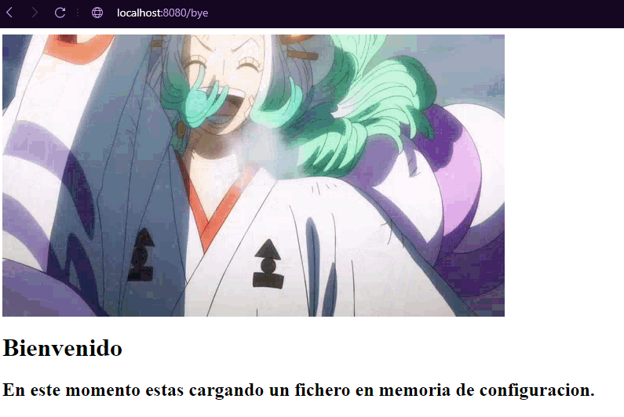
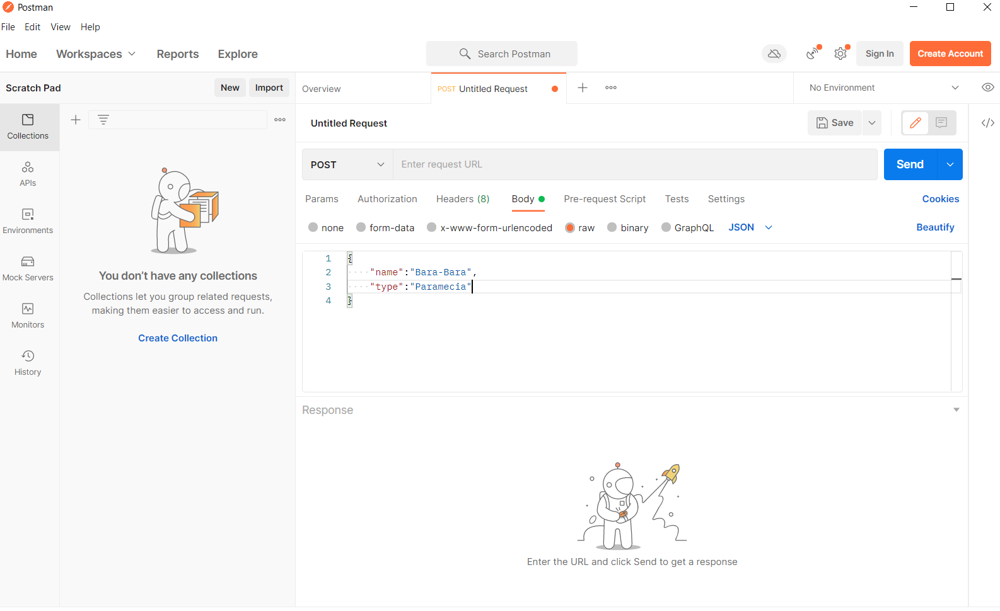
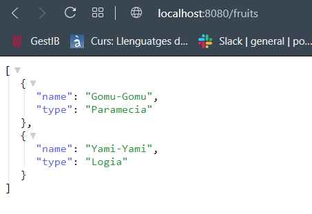
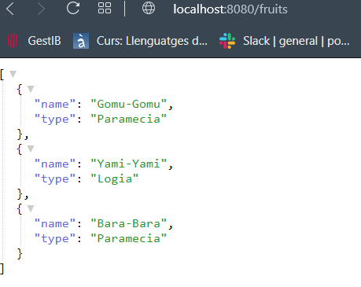

# Quark_Bye

## Que es Quark_bye?

Tranquilo , solo es una prueba no es muy importante para ti, a no ser que quieras ver el proceso de un mono golpeando el teclado y que hace una API REST con quarkus.

# Pasos realizados

Se han realizado los pasos suponiendo que maven ya esta instalado , si no , el primer paso es instalar maven.

## Crear Hello World

Lanzamos maven con el pluguin de quarkus y su version, para encontrar la version actualizada he buscado el plugin de quarkus y he seleccionado a su pagina oficial [Quarkus](https://quarkus.io/guides/maven-tooling)

```bash
$ mvn io.quarkusplatform:quarkus-maven-plugin:2.7.5.Final:create \
    -DprojectGroupId=edu.poniperro \
    -DprojectArtifactId=my-getting-started \
    # para generar la clase REST
    -DclassName="edu.poniperro.quickstart.GettingResource" \
    # Primera ruta
    -Dpath="/bye"
```

Ahora se generara la aplicacion y para lanzar nuestra aplicacion en modo dev. El modo dev lo que hace es que no hay necesidad de compilar cada vez que hagamos un cambio , hará restart de una forma bastante rapida.

```bash
$ ./mvnw compile quarkus:dev
```

La aplicacion estara corriendo en el localhost:8080

Para comprobar que funciona usamos:

```bash
$ curl localhost:8080/bye
```

En el caso que no develva nada deberiamos comprobar que el path se ha creado como esperabamos, se encuentra en `./code-with-quarkus/src/java/edu/poniperro/quickstart/GreetingResource.java`

Estara entre parentesis en un @Path , como es de suponer , ahi defines el path. En el caso de que no ponga "/bye" es por eso que no os funciona.

Si no os gusta la consola o le teneis miedo porque a veces muerde o grita , podemos ir al navegador y ponel en el buscador `localhost:8080/bye`

### El curioso del hello world

Si te fijas en el codigo que hay en el path:

```Java
@Path("/bye")
public class GreetingResource {

    @GET
    @Produces(MediaType.TEXT_PLAIN)
    public String hello() {
        return "bye";
    }
```

En @Produces(MediaType.TEXT_PLAIN) hay TEXT_PLAIN , eso significa que puede producir otro tipo de texto , asi que deciciprobar el primero que salia que era TEXT_HTML y añadir un codigo HTML que quedo de esta manera:

```Java
@Path("/bye")
public class GreetingResource {

    @GET
    @Produces(MediaType.TEXT_HTML)
    public String hello() {
        return ""
                +
                "<h1>Bienvenido</h1>" +
                "<h2>Informo que va a estar poblado de cosas de One Piece</h2>";
    }
```

Por arte de magia funciona


## Parametros configuracion

Por defecto cuarkus lee la configuracion en el fichero application.properties, que se encuentra en `./code-with-quarkus/src/main/resources/application.properties`

añadimos una linea con para definir un parametro que en mi caso , como quiero que se vea lo de siempre es meter todo el return sin comillas en una sola linea.

```Java
greetings.inicio="<h1>Bienvenido</h1><h2>Informo que va a estar poblado de cosas de One Piece</h2>
```

_Ya se que es una porqueria pero me hacia ilu_ 👉👈

Ahora vamos al codigo y añadimos el siguiente codigo

De esta manera no es un return estatico , sino lo que esta configurado en `./code-with-quarkus/src/main/resources/application.properties`

```Java
    @ConfigProperty(name = "greetings.inicio")
    String msg;
```

Ahora solo tenemos que cambiar el return y poner que devuelve `msg`.

## Compilar de forma nativa

Para compilar de forma nativa vamos a hacerlo en un Docker con el siguiente comando:

```bash
$ ./mvnw package -Pnative -Dnative-image.docker-build=true -DskipTests
```

Ahora tenemos un binario que solo va a funcionar en un contenedor docker.
Asi que creamos el docker con el siguiente comando:

```bash
$ docker build -f src/main/docker/Dockerfile.native -t quakus/gettingstarted .
```

y podemos lanzarlos con:

```bash
$ docker run -i --rm -op 8080:8080 quarkus/getting-started
```

Con esto veremos que cuando compila en nativo la velocidad de arrancada es muy rapida , pero como vamos a estar compilando bastantes veces ya que de momento no tenemos una app definitiva

### Resumen de compilacion nativa

Users de Windows : Teneis problemas. Teneis que seguir esta [guia](https://quarkus.io/guides/building-native-image)

Users de Linux: Aun no he probado. Se supone que no tendreis problemas.

## Sobreescribir configuracion

Podemos sobreescribir los `greetings` de la siguiente manera:

```bash
$ ./mvnw compile quarkus:dev -Dgreetings.inicio="One piece"
```

Podremos comprobar que se ha cambiado con un curl:

```bash
$ curl localhost:8080/bye
```

Si podemos sobreescribir con texto plano vamos a comprobar si le metemos codigo HTML, ya que nosotros tenemos el return con `MediaType.TEXT_HTML`

```bash
$ ./mvnw compile quarkus:dev -Dgreetings.inicio=""
```

Parece ser que si funciona y este es el resultado


Recuerdo que al lanzarlo desde consola de esa manera el cambio solo estara mientras Quarkus este funcionando , ya que si la apagamos, dejara de estar a no ser que volvamos a lanzar quarkus volviendo a sustituir el parametro.

NOTA: Si usamos `s` en la consola de Quarkus para forzar un reinicio no desaparece. Porque se queda el parametro guardado.

## Perfiles de Configuración

Podemos establecer que en el modo dev los parametros sean distintos que cuando compilemos a un -jar.

Para hacer esto volvemos a `application properties`, y en mi caso como quiero cambiar el gif de salida en modo dev, dejo el fichero de la siguiente manera:

```conf
# Configuracion de perfiles

# Configuracion perfil dev

%dev.greetings.inicio=


greetings.inicio=<h1>Bienvenido</h1><h2>Informo que va a estar poblado de cosas de One Piece</h2>
```

De forma que cuando lancemos la aplicacion en forma de dev saldra cambiado lo especificado en el perfil de %dev.

## Customizar perfiles

Vamos a añadir un perfil llamado "onepiece" (esto es para que se vea que se puede poner cualquier nombre).

Abrimos el ficher donde pusimos la configuracion de perfiles la ultima vez y añadimos estas lineas de código

```conf

# Configuracion de perfil personalizado

%onepiece.greetings.inicio=<h1>Bienvenido</h1><h2>En este momento estas cargando el perfil 'onepiece'</h2>
```

Ahora tenemos creado el perfil onepiece con esta configuracion , ahora para cargar este perfil en el lanzamiento de la aplicacion hay que hacer lo siguiente:

```bash
$ ./mvnw compile quarkus:dev -Dquarkus-profile=onepiece
```

De forma que cambiará y se verá asi:


## Cargar configuracion otro fichero

Creamos una clase nueva , yo la voy a crear en `edu.poniperro.quickstart` , le llamaré "InMemoryConfigSource" y va a implementar la interfaz `ConfigSource`.

```Java
public class InMemoryConfigSource implements ConfigSource
```

Asi que meteremos lo metodos que tenemos que implementar. Le creamos atributo que es un Map que va a contener los valores. Como tenemos los valores predefinidos, vamos a crear un constructor que va a meter los valores al Map.

```Java
    private Map<String, String> properties = new HashMap<>();

    public InMemoryConfigSource() {
        this.properties.put("greetings.inicio",
                "<h1>Bienvenido</h1><h2>En este momento estas cargando un fichero en memoria de configuracion.</h2>");
    }
```

Vamos a hacer los metodos

```Java
    @Override
    public String getName() {
        // TODO Auto-generated method stub
        return null;
    }

    @Override
    public Set<String> getPropertyNames() {
        // TODO Auto-generated method stub
        return null;
    }

    @Override
    public String getValue(String arg0) {
        // TODO Auto-generated method stub
        return null;
    }
```

El primero que aparece es getName , que es simplemente un nombre , ponemos el nombre que queramos en String.

```Java
    @Override
    public String getName() {
        // TODO Auto-generated method stub
        return "Configuracion en memoria";
    }
```

El segundo es getProperties , que devuelve los nombres de las propiedades cargadas.

```Java
    @Override
    public Set<String> getPropertyNames() {
        return this.properties.keySet();
    }
```

El tercero es getValue(String arg0) que nos pasaran un argumento para sacar el valor de esa key.

```Java
    @Override
    public String getValue(String arg0) {
        return this.properties.get(arg0);
    }
```

Ahora vamos a sobre escribir el getOrdinal que es para dar prioridad de carga a los valores.

```Java
    @Override
    public int getOrdinal() {
        return 999;
    }
```

Ahora hay que registrar este fichero de configuracion. Para ello hay que crear un fichero en META-INF que se llame services y dentro otro que se llame como todo el paquete de la interfaz que aplicamos que es ConfigSource. Dentro del fichero metemos el package y nombre de la clase que hemos creado.

`code-with-quarkus\src\main\resources\META-INF\services\org.eclipse.microprofile.config.spi.ConfigSource`

```
edu.poniperro.quickstart.InMemoryConfigSource
```

Ahora podemos iniciar quarkus:

```bash
$ ./mvnw quarkus:dev
```

Y podemos ver que ha cargado la configuracion de memoria.



## Realizar un POST

Vamos a realizarun post, basandome en una plantilla de la doc de quakus.
Para ello creo una carpeta que se llama model, donde se va a crear una clase java que va a ser la modelo para pasarla a JSON.

La clase modelo ha quedado asi:

```Java
package edu.poniperro.quickstart.model;

public class DevilFruit {

    public String name;
    public String type;

    public DevilFruit() {
    }

    public DevilFruit(String name, String type) {
        this.name = name;
        this.type = type;
    }
}
```

Una vez creado el modelo creo una clase para tener el path. Definimos El GET , POST y DELETE.
El GET , es relativamente igual que el otro. EL POST , definimos que será un JSON_type.
EL DELETE aparecerá aquí pero no se explicará hasta mas tarde.

Una vez comentado lo anterior, la clase del path nos quedaría tal que así:

```Java
package edu.poniperro.quickstart;

import java.util.Collections;
import java.util.LinkedHashMap;
import java.util.Set;

import javax.ws.rs.Consumes;
import javax.ws.rs.DELETE;
import javax.ws.rs.GET;
import javax.ws.rs.POST;
import javax.ws.rs.Path;
import javax.ws.rs.core.MediaType;

import edu.poniperro.quickstart.model.DevilFruit;

@Path("/fruits")
public class DevilFruits {

    private Set<DevilFruit> fruits = Collections.newSetFromMap(Collections.synchronizedMap(new LinkedHashMap<>()));

    public DevilFruits() {
        fruits.add(new DevilFruit("Gomu-Gomu", "Paramecia"));
        fruits.add(new DevilFruit("Yami-Yami", "Logia"));
    }

    @GET
    public Set<DevilFruit> list() {
        return fruits;
    }

    @POST
    @Consumes(MediaType.APPLICATION_JSON)
    public Set<DevilFruit> add(DevilFruit fruit) {
        fruits.add(fruit);
        System.out.println(fruit);
        return fruits;
    }

    @DELETE
    public Set<DevilFruit> delete(DevilFruit fruit) {
        fruits.removeIf(f -> f.name.contentEquals(fruit.name));
        return fruits;
    }
}
```

### Comprobar POST con Postman

Descargamos Postman y lo abrimos, le damos a new HTTP Request.
Nos saldrá un desplegable y seleccionamos el POST.Cuando estemos en el POST vamos a body, seleccionamos raw , cambiamos text por JSON. Abajo escribiremos el JSON que vamos a insertar , que debe seguir el criterio de las "DevilFruits"

Deberia quedar así:


Pondriamos arriba la direccion , en mi caso `http://localhost:8080/fruits`

Antes del post, si en el navegador ponemos la direccion se vería algo así:



Despues del post se debería ver algo así:



## Meter DELETE

En la clase del path comentada anteriormente esta añadido el DELETE, solo hay que añadir que recibe JSON para hacer el DELETE. De forma que la funcion del DELETE te quede así:

```Java
    @DELETE
    @Consumes(MediaType.APPLICATION_JSON)
    public Set<DevilFruit> delete(DevilFruit fruit) {
        fruits.removeIf(f -> f.name.contentEquals(fruit.name));
        return fruits;
    }
}
```

### Testear DELETE con Postman.

Sigue el inicio del anterior , lo que cambiaras el POST por el DELETE, siguiendo el mismo formato , en caso. Ten en cuenta que tendras que eliminar una fruta que exista para ver si funciona.

### Se esta realizando el curso de OpenWebinars por Alex Soto.

Todos los pasos seguidos se han tomado como referencia del curso y aqui me lo estoy documentando para un futurno no muy lejano cuando me olvide de como se hacia algo y porque más o menos.

Recomiendo encarecidamente el curso asi que si podeis pasaros lo disfrutareis.

De momento es un hello world con pruebas , espero que poco a poco pueda cambiar el README para que sea un mono tecleando algo que entiende.

El nombre de Quarkus me recuerda a la onomatopeya de un pato "cuak", asi que si que aqui os dejo a mi "cuakus"


